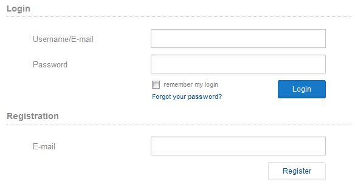
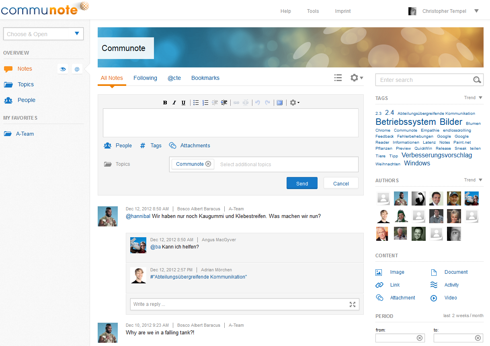
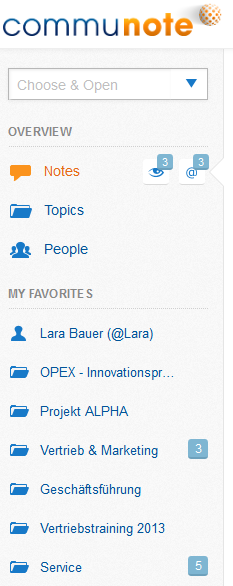
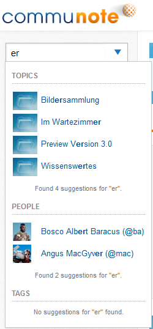
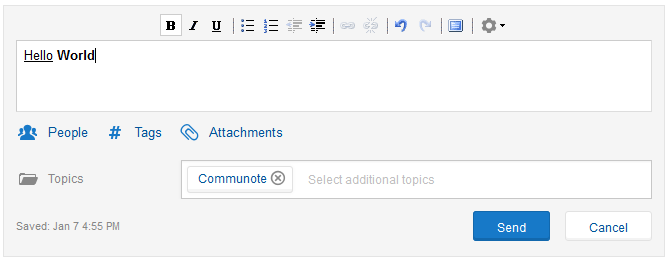
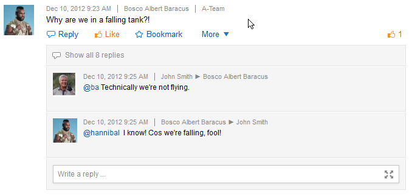

The surface of Communote is built to help you communicate in your daily communication and research. In this chapter the basic interface and functions will be explained. A detailed explanation of the app's functions can be found in the following chapters.

## 1.1 Register to Communote

In order to register to a Communote Microblog with free access, you only need to type in your email address in the Register form (see Figure "Login & Registration"). You will then receive an e-mail with an automatically generated link that closes off the registration.

_Figure "Login & Registration"_

Your Communote system may not be open to all users. In that case you do not receive an e-mail right away, but your registration has to be confirmed by an admin of the system before you can start using Communote.

## 1.2 Login to Communote

Using Communote always starts with logging in. In order to do so, start Communote and log in using your account data: Type in your user name and your password. If you want to be logged in automatically in the future, check "remember my login".
After the login you will see the homepage of Communote.

_Figure "Communote Interface"_

## 1.2 Topbar

In the upper part of the interface you can see "Help" and "Imprint" as well as see and edit your profile under "Your Name". "Tools" will show you further information about working with Communote, for example the Communote Bookmarklet and the Communote Mobile App. You able to logout via the last entry of the user menu.

_Figure "Topbar"_

## 1.3 Navigation and Favorites on the left sidebar

On the left hand side of your screen you can choose in which topic you would like to act. When you choose "Notes" you will be guided to an overview of all messages in the system that you are able to see. This is also the welcome screen that you were brought to when you logged into Communote.

"Topics" and "Persons" shows a display of all (visible to you) topics and users in the system. You can search within this overview page to look at the Topics or users. You can also search for a specific user or topic by starting to type in the "Choose and open" field. Most of the time it is enough to type the first letters and the system will suggest a specific user or topic for you (see figure "Sidebar").

 

_Figure "Sidebar" (left) and with auto suggest (right)_

## 1.4 Basic Functions

### 1.4.1 Write a message

The note input field consists of an input box with different options for formatting. Several other options for writing a note are listed below the input field.

_Figure "Note Input Field"_

**Note_:_** If you already familiar with the older Version Communote (2.4), you will notice that the topic selection is not available above the editor anymore. You will now find that function below the editor and you can also choose more than one topic where the message is posted.

### 1.4.2 Read Messages

You can find the message bar right in the middle of the interface taking up the majority of Communote's interface. That's because Communote is all about the exchange of information and communicating!
In this section we will be explaining the layout of Communote's interface.

Between the banner on top and the editor you can see the tab section. This section changes depending on the area of Communote you're in:
If you find yourself in the overview page for notes ("notes" at the left sidebar) you will see "All notes", "Following", "@[YourName]" and "Bookmarks".

_Figure "Tab-Area Global"_

If you find yourself in a specific topic, these tabs will change into "Notes", "Subtopics", "Members", and "Info".

_Figure "Tab-Area Context"_

Below the editor you can find all notes you have the rights to see based on your user's permissions. The list of notes is sorted by date of creation downward (_meaning that new notes are on top and older notes are below_). A note consists of text, the profile picture of the author, the date of creation, and the topic that the note was posted in (see figure "Note"). Furthermore, other users can be notified about the note by being linked to the note using @mentions. Tags and attachments can also be added to the note. Users that have been mentioned and tags that are included are shown as a (blue) link within the note. If you click on that link, you are shown a list of notes that is filtered by that person or tag.

_Figure "Note"_

You can easily add Video-Links (YouTube or Vimeo) to your note's text. After you post these links into the message body, they will automatically be transformed into inbound links and integrated into the note. Videos can now automatically be played within the system (see Figure "Pictures & Videos inline")

_Figure "Pictures & Videos inline"_

Notes that are older than the notes shown on the initial screen will be loaded automatically via "endless scrolling". If you need to get back on top quickly, you can use the "back to top"-Button, which will show up on the right hand side as you get further down the page.

_Figure "Endless Scrolling"_

Within the list of notes, Communote has a special display for users, tags, and topics: Small hover cards with the most essential information and functions will be shown as you pass the mouse over the user, the tag, or the topic. For example, if you pass over the profile picture of a user, the hover card will show the name, position, phone number and tags of the specific user. Additionally the function "following" is available.

_Figure "Hover Cards"_

### 1.4.3 Search Notes

On the right side of the interface you can find an extensive search function. On the upper part, there is a search field in which you can search Communote for a **specific term**. Communote will suggest you tags, authors (or subtopics) based on your search term.

_Figure "Search": Search sidebar normal (left) and the search sidebar with suggested filters for the filtered tag "status" (right)_

All active filters are listed under "Filtered By". The tag cloud, the authors and the topic filter will match with an active filter.

More details for the different filters will be explained in Chapter 2.3.

As you have chosen a specific topic, person or tag, other filters will be proposed for you: Mentions, your Bookmarks, Following or a topic filter. The topic filter will only showed if the notes are written in more than one topic.

**Note:** If you are using the full text search, activities will not be included in the results. Only if you are using the tag- or author search those results will be included.
